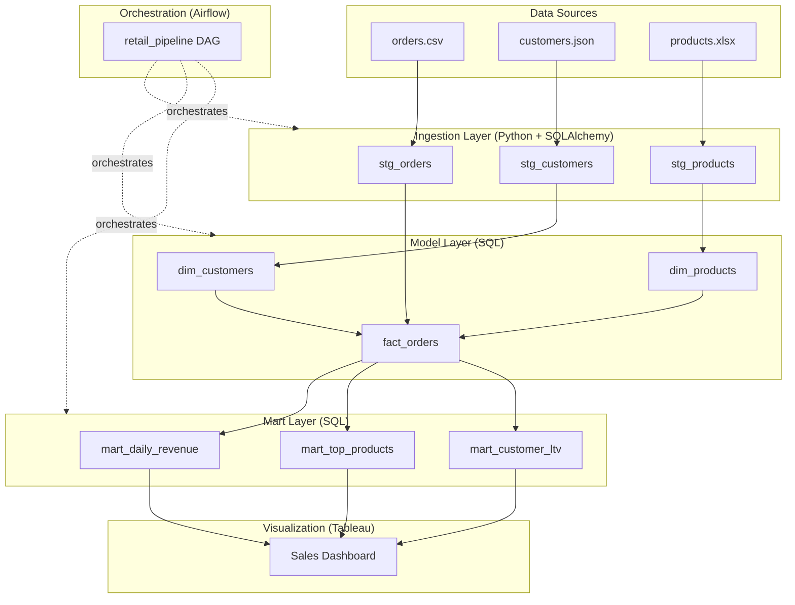

# Architecture

```mermaid
flowchart TD
    subgraph Sources["Data Sources"]
        A[orders.csv]
        B[customers.json]
        C[products.xlsx]
    end

    subgraph Ingestion["Ingestion Layer (Python + SQLAlchemy)"]
        D[stg_orders]
        E[stg_customers]
        F[stg_products]
    end

    subgraph Models["Model Layer (SQL)"]
        G[dim_customers]
        H[dim_products]
        I[fact_orders]
    end

    subgraph Marts["Mart Layer (SQL)"]
        J[mart_daily_revenue]
        K[mart_top_products]
        L[mart_customer_ltv]
    end

    subgraph Orchestration["Orchestration (Airflow)"]
        M[retail_pipeline DAG]
    end

    subgraph Visualization["Visualization (Tableau)"]
        N[Sales Dashboard]
    end

    A --> D
    B --> E
    C --> F

    D --> I
    E --> G
    F --> H

    G --> I
    H --> I

    I --> J
    I --> K
    I --> L

    J --> N
    K --> N
    L --> N

    M -.->|orchestrates| Ingestion
    M -.->|orchestrates| Models
    M -.->|orchestrates| Marts
```